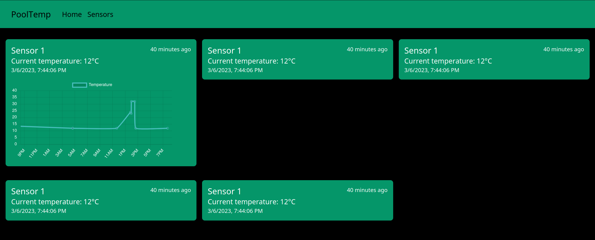

# PoolTemp
A web-based software to track the temperature of any swimming pool or other sensor.

# Features
- [x] Display current temperature of sensor
- [x] Display history of the last 24 hours of a sensor
- [x] Up-to-date measurements can be collected via API
- [x] Responsive to support mobile devices
- [ ] Support multiple sensors

# Result

# Software
The software consists of an API (pool-temp-backend) and a webinterface (pool-temp-web).

The specification of the API can be found here (API-spec)[pool-temp-backend/api-spec.yaml]
# Hardware
Hardware is yet to be developed, however I am planning on using an ESP-32 in combination with a waterproof ds18b20 sensor to get precise measurements of the water temperature.

# Running the software
To run the software simply run the provided docker compose file with `docker compose run`.

The frontend is now listening on port `3000`, the backend on port `3001`.
